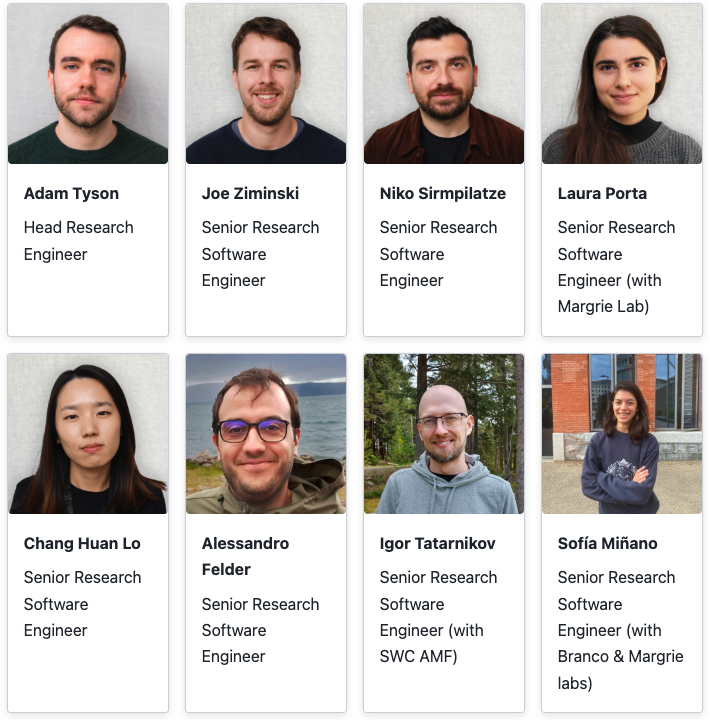
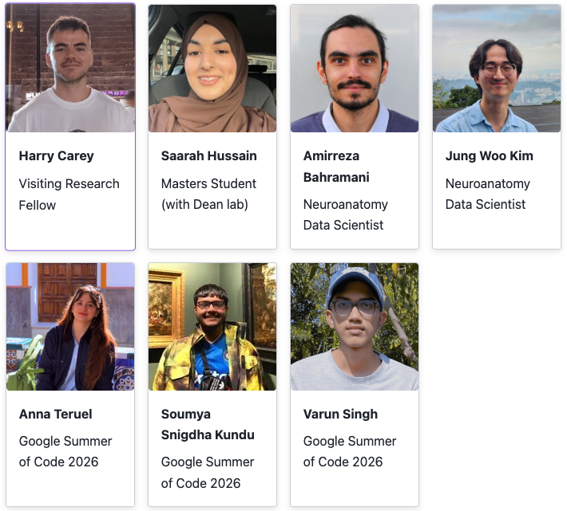
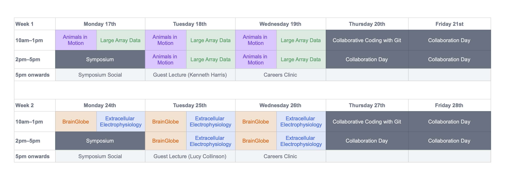
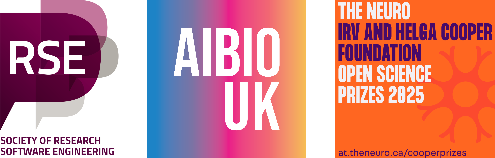

## Useful links

:::: {.columns}
::: {.column}

:::

::: {.column}
- [Event guide](https://docs.google.com/document/d/16tlglX_sN1CfUWneMnVTqjx78XEXLUU_LjADVM3FOKo/edit?usp=sharing)
- [Event website](https://neuroinformatics.dev/open-software-summer-school)
:::
::::

::: aside
These slides are available at <https://github.com/neuroinformatics-unit/slides-osss-intro>
:::

## Neuroinformatics Unit

:::: {.columns}
::: {.column}
 
:::
::: {.column}

:::
::::

## Code of Conduct

* Reminder: please follow the [code of conduct](https://docs.google.com/document/d/16tlglX_sN1CfUWneMnVTqjx78XEXLUU_LjADVM3FOKo/edit?tab=t.adfezapzy955)
* Summary: be kind, respectful and professional
* Contacts: Adam, Sofia, Niko or Alessandro

## Schedule

## Maps

:::: {.columns}
::: {.column}

:::

::: {.column}

:::
:::: 

Ask a member of NIU for a quiet space

## Ask for help

* Ask any member of NIU
* Use the `OSSS-2026` channel on Zulip
* Work together
* Let Adam know if you don't want to appear in photos

## AI policy {.smaller}

**During teaching & exercises**

* Learning requires friction!
* No AI assistants inside your IDE or terminal (Copilot, Cursor, Claude Code, etc.)
* Chat-based tools are fine for looking things up, like a search engine

**During collaboration days**

* AI use is up to you
* If working on a joint project, agree on it with your collaborators first

## Join the socials {.smaller}

**Week 1**

* Tuesday 18th August: Celtic folk music near King's Cross
* Thursday 20th August: Walk to Primrose Hill

**Week 2**

* Tuesday 25th August: Celtic folk music near King's Cross
* Thursday 27th August: Run
* Friday 28th August: Walk to Primrose Hill

::: aside
More details in the event guide and on the "Social" topic on Zulip.
Use that topic to self-organise additional social activities.
:::

## Made possible by {.smaller}

{height=50% width=50% fig-align=center}
{height=80% width=80% fig-align=center}

## Enjoy!

:::: {.columns}
::: {.column}
* Remember to have fun!
* Meet new people - follow [the PacMan rule](https://psychsafety.com/the-pac-man-rule/).
* Think of [ideas for the collaboration days!](https://github.com/neuroinformatics-unit/osss26-collaboration-day)
:::
::: {.column}

:::
::::

# Collaboration days

## Our definition of collaboration

Work together on a small project in quick, dirty and fun way

## Schedule

- Thursday 10:00 - 17:00
- Friday 10:00 - 17:00

## Thursday (approximate) {.smaller}

10:00 - 11:15: Intro to collaboration, getting started

11:30 - 13:00: Git course (part 1) / collaboration

14:00 - 15:30: Git course (part 2) / collaboration

15:30 - 15:45: Data management with datashuttle (Joe Ziminski) / collaboration

15:45 - 17:00: collaboration

## Friday (approximate)

Collaboration 10:00-16:00

11:00 A high-level introduction to whole-brain image analysis with BrainGlobe (Alessandro Felder); Adapting cellfinder to single-channel and 2.5-D data (Soumya Snigdha Kundu)

14:00 QUINT workflow (Harry Carey)

16:00 Lightning talks

17:45 Walk to Primrose Hill

## Goal

Enable knowledge exchange through hands-on work

:::: {.columns}
::: {.column}
Focus on collaboration:

* Active listening
* Being inclusive
* Taking initiative
* Planning
* Stepping out of your comfort zone
:::

::: {.column}
Opportunity to foster:

* Collaborative skills
* Coding skills
* Creativity skills
* Social skills
* Time-management skills
:::
::::

## Collaboration tips {.smaller}

Everyone gets opportunity to contribute

* Be flexible and inclusive
* Code is not the only thing that needs doing
* Planning, documenting, organizing, presenting, reading, time-keeping…

Working together

* Start by introducing yourself, your work and your skills to the group
* Make use of GitHub, Shared google doc
* Keep in touch with the group throughout

Look after yourself

* Take breaks, stretch, rest your eyes
* Enjoy

## Collaboration tips {.smaller}

* Settle on doable plan

Things will go wrong – that’s OK!

* Work incrementally and version-control your work
* You have a very short amount of time!
* Focus on minimum viable "product"

Report back in short lightning presentations at 4 PM [(joint slide-deck)](https://docs.google.com/presentation/d/1bVvpB7u46DEUsfPD5V6A08xU_hmRg7d9WYDDPKsDHhk/edit?usp=sharing)

* What you did
* What you learnt
* Future work

We will check in regularly

## What's next

[GitHub project board](https://github.com/orgs/neuroinformatics-unit/projects/21)

# Have fun!

